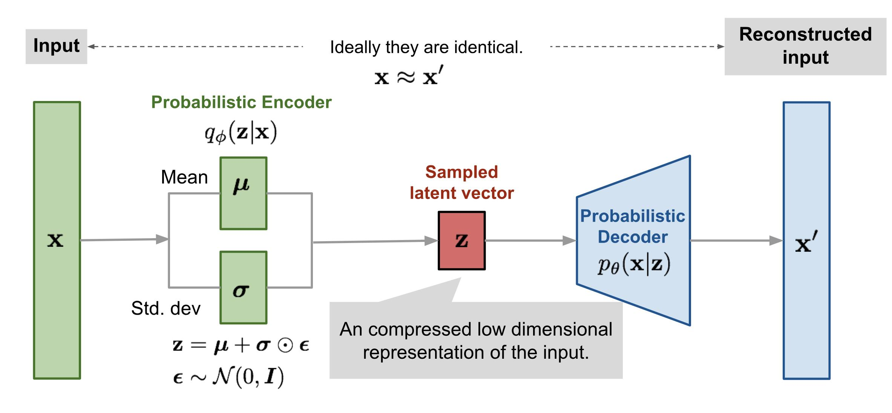

# Pseudodata generation using Variational Autoencoder.
# 📌 Problem Statement

Real-world medical datasets are often limited, imbalanced, or sensitive, making it difficult to train robust machine learning models. In healthcare domains like diabetes prediction, this can lead to poor generalization and biased predictions.

This project addresses the problem by generating realistic synthetic data using a Variational Autoencoder (VAE) and evaluating its usefulness in improving classification performance.

# 💡 Solution Overview

The solution combines:

Deep Generative Modeling (VAE) → to learn data distribution
Data Augmentation → to enrich dataset
Classical Machine Learning (Random Forest) → for prediction

The key idea is:

Learn the underlying probability distribution of the dataset and generate new samples that resemble real-world data.

# ⚙️ How the System Works
##  Step 1: Data Preprocessing
Load dataset
Keep only numerical features
Handle missing values using mean imputation
Normalize data using Z-score standardization

👉 Why?
Neural networks perform better when data is scaled and clean.

##  Step 2: Variational Autoencoder (VAE)

The VAE consists of two main components:

### 🧩 Encoder
Compresses input data into a latent representation
Outputs:
Mean (μ)
Log variance (σ²)
🎲 Latent Space Sampling

Instead of directly encoding, we use:

## z = μ + σ * ε

where ε is random noise.

👉 Why?
This allows the model to learn a continuous probabilistic space, enabling generation of new samples.

### 🔄 Decoder
Reconstructs data from latent vector
Learns how to map compressed features back to original space
🔹 Step 3: Loss Function (ELBO)

The model optimizes:

### ELBO = Reconstruction Loss + β × KL Divergence
Reconstruction Loss → ensures output is close to input
KL Divergence → regularizes latent space to follow normal distribution

👉 Insight:
This balance ensures the model does not overfit and can generate new realistic samples.

##  Step 4: Model Training
Optimizer: Adam
Learning Rate: 0.0007
Epochs: 200

During training, the model learns:

Patterns in medical data
Relationships between features
Data distribution
##  Step 5: Synthetic Data Generation
Random vectors are sampled from latent space
Passed through decoder
Converted back to original scale
##  Flow Diagram

👉 Result:
New patient records that resemble real data.

## Step 6: Real-World Constraints

To ensure realism:

Age → limited between 18–80
Pregnancies → integer range
Outcome → binary (0/1)
Negative values → removed

👉 Why?
Raw neural outputs may be unrealistic; constraints enforce domain validity.

## Step 7: Evaluation Strategy

To test usefulness of synthetic data:

Split real dataset into train/test
Combine:
* Real training data
* Synthetic generated data
* Train Random Forest classifier
* Evaluate on real test data
#  Results
Synthetic data successfully mimics real distribution
Improved model robustness
Achieved:

### Accuracy > 90%

## Key Learnings
VAE learns probability distributions, not just patterns
Latent space enables controlled data generation
Synthetic data can improve model generalization
Post-processing is essential for real-world reliability
## Why This Project Matters

This project demonstrates:

Practical use of Generative AI in healthcare
Strong understanding of:
* Deep Learning (VAE)
* Machine Learning (Random Forest)
* Data Engineering
* Ability to build end-to-end ML pipelines
# Future Scope
* Conditional VAE (label-aware generation)
* GAN-based tabular synthesis
* Hyperparameter tuning
* Deployment as API or web app
## 📜 License

This project is licensed under the **MIT License**.

---

## 🙌 Acknowledgment

Developed as part of **GEN-AI**  
KLE Technological University

---

## ⭐ Support

If you like this project, give it a ⭐ on GitHub!
